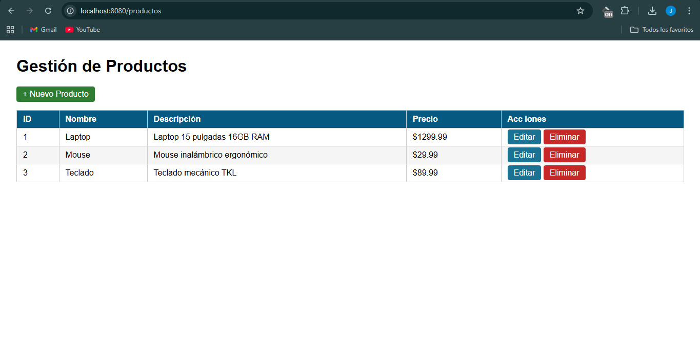
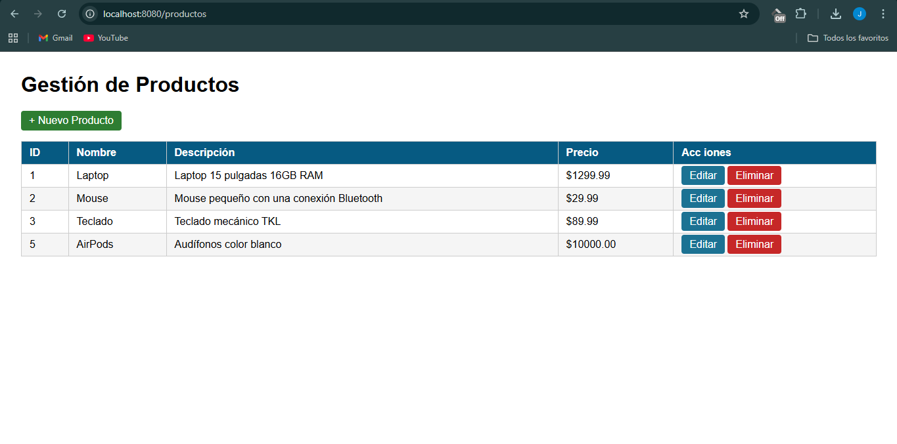
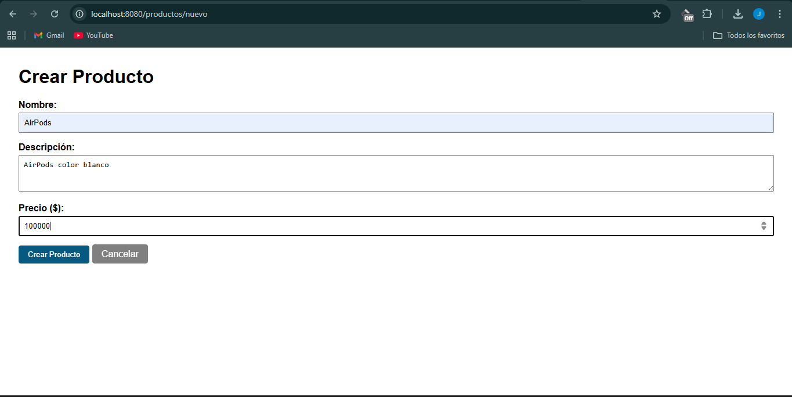
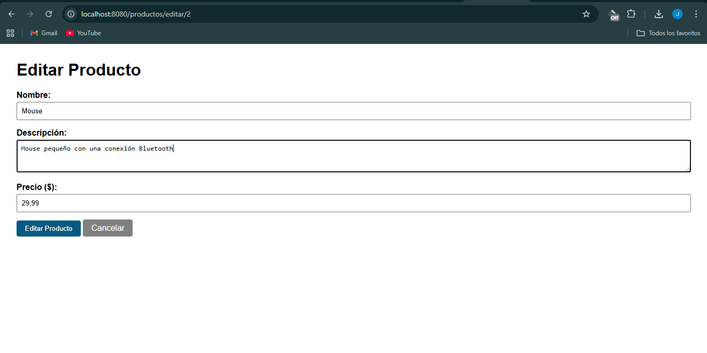

# Gestión de Productos - Spring Boot

Aplicación web CRUD para gestión de productos desarrollada con Spring Boot y Thymeleaf.
Proyecto correspondiente a la Unidad 7 - Post-Contenido 1 de Programación Web.
**Autor:** Johan Steven Carreño Daza

---

## Tecnologías utilizadas

- Java 21
- Spring Boot 3.5.13
- Thymeleaf (motor de plantillas)
- Maven
- Spring Boot DevTools

---

## Estructura del proyecto
productos-web/
├── src/main/java/com/universidad/productosweb/
│   ├── controller/
│   │   └── ProductoController.java   # Maneja las rutas HTTP
│   ├── model/
│   │   └── Producto.java             # Clase modelo con atributos del producto
│   ├── service/
│   │   └── ProductoService.java      # Lógica de negocio y persistencia en memoria
│   └── ProductosWebApplication.java  # Clase principal
├── src/main/resources/
│   ├── templates/productos/
│   │   ├── lista.html                # Vista con tabla de productos
│   │   └── formulario.html           # Vista para crear y editar
│   └── application.properties       # Configuración del servidor
└── pom.xml

---

## Instrucciones de ejecución

**1. Clonar el repositorio:**
```bash
git clone https://github.com/[tu-usuario]/apellido-post1-u7.git
cd apellido-post1-u7
```

**2. Ejecutar la aplicación:**
```bash
mvn spring-boot:run
```

**3. Abrir en el navegador:**
http://localhost:8080/productos

---

## Funcionalidades

- **Listar** todos los productos registrados
- **Crear** un nuevo producto desde un formulario
- **Editar** un producto existente con formulario prellenado
- **Eliminar** un producto con confirmación
- Patrón **Post/Redirect/Get (PRG)** para evitar reenvío de formularios

---

## Arquitectura

El proyecto sigue el patrón **MVC (Modelo - Vista - Controlador)**:

- **Modelo:** clase `Producto` con atributos id, nombre, descripción y precio
- **Vista:** plantillas Thymeleaf en `templates/productos/`
- **Controlador:** `ProductoController` que gestiona las rutas y conecta modelo con vista
- **Servicio:** `ProductoService` simula una base de datos usando un `LinkedHashMap` en memoria

## Capturas de pantalla

### Lista de productos


### CRUD del proyecto


### Crear Producto


### Editar Producto
